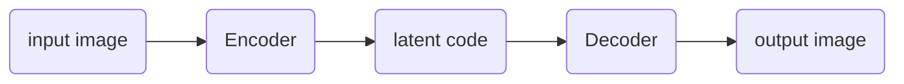

**Task1: Generate multi-view images from a single-view input**

**impact**

> broad applications in vision, graphics, and robotics

**related work**

> model-driven synthesis: 
>
> data-driven generation: [^1]
>
> combination of the both
>
> GAN: [^Tran et al., 2017] [^Zhao et al., 2017]

**GAN pipeline in this problem**

[^1]:Multi-view perceptron: a deep model for learning face identity and view representations
[^Tran et al., 2017]:Disentangled Representation Learning GAN for Pose-Invariant Face Recognition
[^Zhao et al., 2017]: Multi-view image generation from a single-view