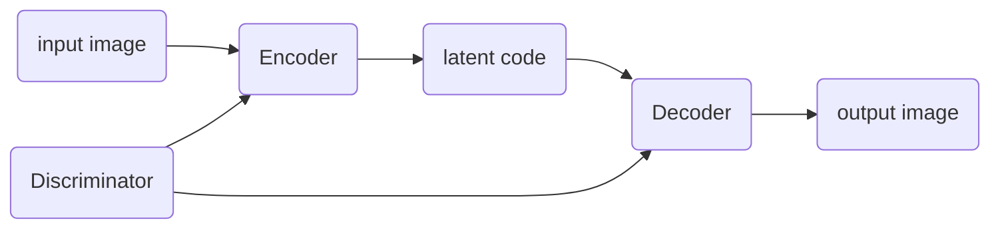

**Task1: Generate multi-view images from a single-view input**

**impact**

> broad applications in vision, graphics, and robotics

**related work**

> model-driven synthesis: 
>
> data-driven generation: [^Zhu et al., 2014]
>
> combination of the both [^Peng et al., 2017]
>
> GAN: [^Tran et al., 2017] [^Zhao et al., 2017]

**GAN pipeline in this problem**

disentangle pose and identity factors by cross-reconstruction [^Peng et al., 2017][^Zhu et al., 2014]

[^Peng et al., 2017]:Reconstruction-based disentanglement for pose-invariant face recognition
[^Zhu et al., 2014]:Multi-view perceptron: a deep model for learning face identity and view representations
[^Tran et al., 2017]:Disentangled Representation Learning GAN for Pose-Invariant Face Recognition
[^Zhao et al., 2017]: Multi-view image generation from a single-view

## CR-GAN

[CR-GAN: Learning Complete Representations for Multi-view Generation]()

**`[IJCAI 2018]`**	**`(Rutgers University)`**	**`[Yu Tian, Xi Peng]`**	**([:memo:]())**	**[[:octocat:](https://github.com/bluer555/CR-GAN)]**

Click to expand

> **Keywords**

Two-pathway

> **Goal**

find useful directions in $z$ space

> **Pipeline**

The generator $G$ produces a synthesis image $G(\mathbb{z}, v)$ with a random noise $\mathbb{z}$ under a view label $v$.

The discriminator $D$ contains two parts $(D_s, D_v)$. $D_s$ estimates the image quality, i.e., how real the image is, $D_v$ predict the view of given image.

The encoder $E$ reconstructs a latent vector $\bar{\mathbb{z}}$ from an image, in other words, $E$ will be learned as an inverse of $G$ and the latent space could represent the total image space.

In this problem, the output of $E$ should preserve the same identity and we hope $E$ could disentangle the viewpoint from the identity.

To be specific, we first sample a pair of real images $(\mathbb{x}_{i}, \mathbb{x}_{j})$ which are the same identity but different views $v_i,v_j$. The goal is to reconstruct $\mathbb{x}_j$ from $\mathbb{x}_i$. To achieve this, $E$ takes $\mathbb{x}_i$ as an input and outputs an identity-preserved representation $\bar{\mathbb{z}}$ together with the view estimation $\bar{\mathbb{v}}$: $(\bar{\mathbb{z}}, \bar{\mathbb{v}}) = E(\mathbb{x}_i)$. $G$ takes $\bar{\mathbb{z}}$ and $v_j$ as input, then produce $\tilde{\mathbb{x}}_{j}$ which should be the reconstruction of $\mathbb{x}_{j}$. 

在第一轮训练中，训练 $G$ 和 $D$， $G$ 想尽可能生成与真图像的假图，$D$ 想尽可能分辨出真图和假图。 

$\{D_s(\mathbb{x}), D_s(G(\mathbb{z}, v))\}$ 和 $\{D_v(\mathbb{x}), v\}$ 差距要尽可能小

> 只能同时识别身份和角度，建立的是真图和假图之间的关系，还缺乏同一身份不同角度真图或者假图之间的关系

在第二轮训练中，训练 $E$ 和 $D$，希望弥补上面的缺陷，$E$ 想尽可能解码出身份信息和角度信息，所以只要解开了，$G$ 就能继续生成，但 $D$ 需要重新训练别让把相同身份不同位置的

|                                                              |                                         |      |
| :----------------------------------------------------------: | :-------------------------------------: | :--: |
|                        $\mathbb{x}_i$                        | real image $\mathbb{x}$ with view $v_i$ |      |
|                        $\mathbb{x}_j$                        | real image $\mathbb{x}$ with view $v_j$ |      |
| $(\bar{\mathbb{z}}, \bar{\mathbb{v}}) = \left(E_\mathbb{z}(\mathbb{x}_i), E_v(\mathbb{x}_i)\right)$ |                                         |      |
| $\tilde{\mathbb{x}}_{j} = G(E_\mathbb{z}(\mathbb{x}_{i}),v_j)$ |               fake image                |      |

- 

---

