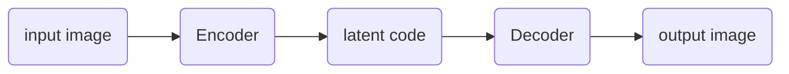

**Task1: Generate multi-view images from a single-view input**

**impact**

> broad applications in vision, graphics, and robotics

**related work**

> model-driven synthesis: 
>
> data-driven generation: [^Zhu et al., 2014]
>
> combination of the both [^Peng et al., 2017]
>
> GAN: [^Tran et al., 2017] [^Zhao et al., 2017]

**GAN pipeline in this problem**

disentangle pose and identity factors by cross-reconstruction [^Peng et al., 2017][^Zhu et al., 2014]

[^Peng et al., 2017]:Reconstruction-based disentanglement for pose-invariant face recognition
[^Zhu et al., 2014]:Multi-view perceptron: a deep model for learning face identity and view representations
[^Tran et al., 2017]:Disentangled Representation Learning GAN for Pose-Invariant Face Recognition
[^Zhao et al., 2017]: Multi-view image generation from a single-view

## CR-GAN

[CR-GAN: Learning Complete Representations for Multi-view Generation]()

**`[IJCAI 2018]`**	**`(Rutgers University)`**	**`[Yu Tian, Xi Peng]`**	**([:memo:]())**	**[[:octocat:](https://github.com/bluer555/CR-GAN)]**

Click to expand

> **Keywords**

PCA

> **Goal**

find useful directions in $z$ space

> **Pipeline**

a view label $v$, random noise $\mathbb{z}$, 

generator $G$ 

and discriminator $D$   

---

